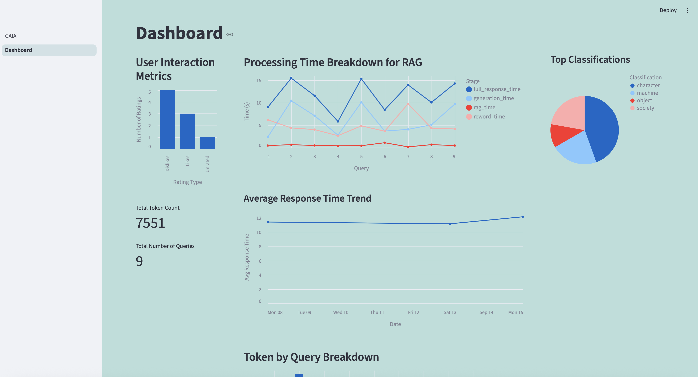

# HorizonZeroDawn_RAG – End-to-End Retrieval-Augmented Generation System

This project implements a full **Retrieval-Augmented Generation (RAG)** pipeline using the **Horizon Zero Dawn game lore dataset**.  
It demonstrates ingestion, retrieval, evaluation, and deployment of an interactive question-answering system, with monitoring and user feedback collection.

---

## 📌 Problem Statement

Modern LLMs are powerful but limited by their training cutoff dates and hallucinations. When users query about **specific knowledge bases (e.g., Horizon Zero Dawn lore)**, the model often produces inaccurate responses.

This project solves that problem by building an **end-to-end RAG pipeline** that retrieves relevant context from a **custom dataset** before sending it to the LLM. The system provides **factual, context-aware responses** through a **Streamlit application**.

---

## 🚀 Project Workflow

1. **Dataset Selection**

   - Chosen dataset: _Horizon Zero Dawn Lore Data_, taken from Horizon Wiki: https://horizon.fandom.com/wiki/Horizon_Wiki
   - Format: Once scraped the data is chunked in a CSV file.

2. **Data Ingestion**

   - Custom Python script loads the dataset, chunks text, embeds it, and stores it in **Qdrant vector DB**

3. **Retrieval Flow**

   - Dense vector search (embeddings) + BM25 for hybrid search
   - Retrieved documents are re-ranked before being passed to the LLM
   - Prompt is dynamically constructed with retrieved evidence

4. **Evaluation**

   **Evaluation files can be found under the data folder**

   - Retrieval approaches evaluated: dense, hybrid (Can be found under data/evaluated_data_dense.json and data/evaluated_data_hybrid.json, both of which used data/evaluation_data.json as a data set.)
   - LLM evaluation with multiple prompt templates and scoring
   - Metrics: Precision@k, Recall@k, and qualitative assessment

   **Comparing the data sets for retrieval results in Hybrid Search (File 2) having the better score in more queries:**

   --- Dataset Comparison ---

   File 1: evaluated_data_dense.json
   File 2: evaluated_data_hybrid.json

   Precision : 0.3673 vs 0.4286 --> File 2
   Recall : 0.2653 vs 0.2653 --> Tie
   F1_Score : 0.2449 vs 0.2653 --> File 2
   Cosine Similarity : 0.8365 vs 0.8604 --> File 2
   Answer Relevancy : 0.6478 vs 0.6299 --> File 1

   **_Comparing prompts:_**

   **I evaluated three prompt strategies. The first is the following:**

   - system_prompt = """You are a hardcore fan of the Horizon game series. You have all of the content memorized and can answer all and any questions about the game."""

   - rag_prompt = f"""
     Question: {llm_query}

     The following is **fictional content from a video game**. Answer the question using only this content:
     {"\n\n-".join(documents)}

     Answer the question in an informative, concise way using only the information above."""

- Failed due to Azure safety/jailbreaking constraints due to attempting to emulate an AI. You can find the example error message under assets/jailbreak_example.txt:https://github.com/teighanmiller/HorizonZeroDawn_RAG/blob/zoomcamp_demo/assets/chailbreak_example.txt

  **The second prompt was:**

  - system_prompt = """You are a hardcore fan of the Horizon game series. You have all of the content memorized and can answer all and any questions about the game."""

  - rag_prompt = f"""This is the question asked of you: {llm_query}

  These are the pieces of information you have recalled based on the query:
  {"\n\n-".join(documents)}

  Using only these documents answer the question. The answer to the question should be clear, informative, and only contain relevant information from the information you recalled.
  Your answer should sound like an answer from the AI GAIA from the video game.
  """

- Failed due to Azure safety/jailbreaking constraints due to attempting to emulate an AI. You can find the example error message under assets/jailbreak_example.txt:https://github.com/teighanmiller/HorizonZeroDawn_RAG/blob/zoomcamp_demo/assets/chailbreak_example.txt

**The third prompt and the used prompt is:**

- system_prompt = """You are providing information about the Horizon game series. Answer the questions clearly and accurately based only on the provided documents.
  """

- rag_prompt = f"""
  Question: {llm_query}

  The following is **fictional content from a video game**. Answer the question using only this content:
  {"\n\n-".join(documents)}

  Answer the question in an informative, concise way using only the information above.
  """

- Works well, provides good responses as seen in the evaluated data sets and most importantly doesn't cause Azure to flag for jailbreaking.

5. **Interface**

   - **Streamlit app** provides a simple, interactive Q&A chat interface
   - Users can type questions and receive fact-grounded answers

6. **Monitoring & Feedback**

   - User queries, responses, and feedback stored in a CSV/DB
   - Dashboard with 5 charts and two number trackers(Altair + Streamlit) to track system usage, accuracy, and feedback trends

7. **Deployment & Containerization**
   - Dockerized setup with `docker-compose`
   - Services:
     - `streamlit_app`: frontend UI
     - `qdrant`: vector database
     - `ingest`: ingest the data from the Horizon Wiki
     - `ingest_preloaded`: ingest the data from the prescraped CSV file
   - Easily reproducible on any system with Docker installed

---

## 🛠️ Tech Stack

- **Frontend:** Streamlit
- **Knowledge Base:** Qdrant (Vector DB)
- **LLM Integration:** OpenAI API (GPT-4o-mini)
- **Evaluation:** Python, custom scripts
- **Monitoring & Visualization:** Pandas, Altair, Streamlit dashboard
- **Containerization:** Docker & Docker Compose

---

## ⚙️ Setup Instructions

### 1. Clone Repository

```bash
git clone https://github.com/teighanmiller/HorizonZeroDawn_RAG.git
cd HorizonZeroDawn_RAG
```

### 2. Prerequisites

- Docker >= 24.x
- Docker Compose >= 2.x
- Git & Curl

### 3. Environment Variables

Create a `.env` file in the root directory:

- The `.env` file must contain these 3 variables:
  OPENAI_API_KEY=your_api_key_here
  AZURE_OPENAI_ENDPOINT_URI=your_endpoint_uri_here
  AZURE_API_VERSION=your_api_version_here

### 4. Start Services

- Follow this instructions in the README.Docker.md file: https://github.com/teighanmiller/HorizonZeroDawn_RAG/blob/zoomcamp_demo/README.Docker.md

### 5. Access the App

- Streamlit UI: [http://localhost:8501](http://localhost:8501)
- Qdrant DB: [http://localhost:6333](http://localhost:6333)

---

## 🎯 Evaluation Criteria Mapping

- **Problem Description (2/2):** Clearly defined problem and motivation
- **Retrieval Flow (2/2):** KB + LLM used, hybrid retrieval supported
- **Retrieval Evaluation (2/2):** Dense, sparse, and hybrid evaluated
- **LLM Evaluation (2/2):** Multiple prompts and approaches tested
- **Interface (2/2):** Streamlit web UI
- **Ingestion Pipeline (2/2):** Automated ingestion with Python script
- **Monitoring (2/2):** User feedback + dashboard with 5+ charts
- **Containerization (2/2):** Full docker-compose setup
- **Reproducibility (2/2):** Clear setup, data included, dependency versions specified

---

## 📊 Monitoring Dashboard

Example dashboard includes:

- Query volume over time
- Retrieval hit-rate
- User satisfaction score
- Average response length
- Failure rate / fallback LLM usage

(_See `/dashboard/monitoring.py` for details_)

---

## 🖼️ Screenshots & Demo

- App screenshot:  
  

- Dashboard example:  
  

- Video demo (click to watch):  
  

---

## 🔮 Future Opportunities

- Deploy to AWS/GCP/Azure for cloud access 🌐
- Extend dataset beyond Horizon Zero Dawn → other games, knowledge bases 🎮
- Add **user query rewriting** for better retrieval 🔄
- Experiment with **re-ranking models** for improved accuracy 📈

---

## 📂 Repository Structure

```
├── data/         # Dataset
├── src/          # Contains python files for ingestion, RAG, UI and the Dashboard
├── docker-compose.yml
├── Dockerfile
├── README.Docker.md
├── README.md
└── requirements.txt
```

---

## 👤 Author

**Teighan Miller**  
Second-Year Mechatronics Engineering, University of Waterloo  
Focus: AI, Machine Learning, and Software Development
